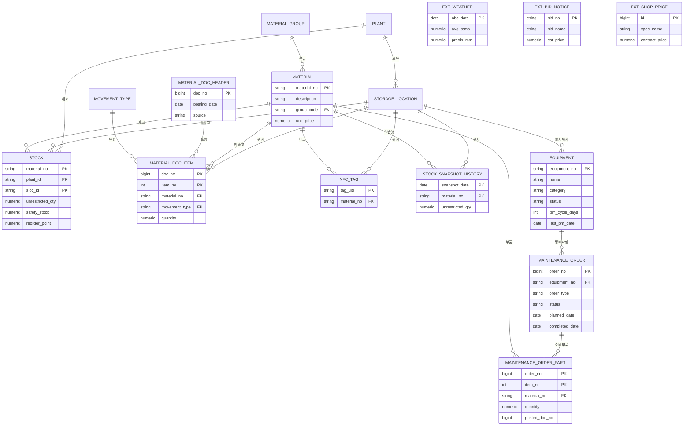

<h1 align="center">StockCast — NFC·공공데이터 기반 공공조달 재고관리 백오피스</h1>

<p align="center">개인 졸업·포트폴리오 프로젝트 · 실제 ERP(Odoo)와 연동되는 재고관리 백오피스</p>

<p align="center">
  
  
  
  
  
  
  
  
  
  
  
  
</p>

공공조달 납품업체가 쓰는 내부 운영 시스템이다. 창고에서 NFC로 실물 재고를 기록하고,
기상청 날씨·공휴일·나라장터 입찰공고·조달청 단가 같은 공공데이터로 수요를 예측해
발주를 결정한다.

실물 재고와 운영은 Odoo가 맡고, 수요예측·안전재고·경영분석은 StockCast가 맡는다.
둘은 XML-RPC로 양방향 연결돼 있다. 여기에 설비 유지보수(SAP PM), 운영자용 시스템
관리, 챗봇, 경영용어 툴팁을 붙여 창고 운영 전반을 한 화면에서 본다.

라이브 데모: **https://stockcast-yeondong.duckdns.org**
[대시보드](https://stockcast-yeondong.duckdns.org/dashboard) ·
[API 문서](https://stockcast-yeondong.duckdns.org/docs) · Odoo ERP `:8069`

<details open>
<summary><b>목차</b></summary>
<br>

* [1. 개요와 기술 스택](#1-개요와-기술-스택)
* [2. 아키텍처](#2-아키텍처)
* [3. 데이터 모델](#3-데이터-모델)
* [4. 공공데이터](#4-공공데이터)
* [5. 수요예측과 재고 분석](#5-수요예측과-재고-분석)
* [6. Odoo 연동](#6-odoo-연동)
* [7. NFC 입출고](#7-nfc-입출고)
* [8. 설비 유지보수·운영 관리·챗봇](#8-설비-유지보수운영-관리챗봇)
* [9. 인프라와 배포](#9-인프라와-배포)
* [10. 보안과 비밀값](#10-보안과-비밀값)
* [11. 만들면서 막혔던 것들](#11-만들면서-막혔던-것들)
* [12. 한계와 개선 방향](#12-한계와-개선-방향)
* [13. 디렉터리 구조와 실행](#13-디렉터리-구조와-실행)

</details>

---

## 1. 개요와 기술 스택

창고 직원이 NFC 태그로 입출고를 찍으면 Odoo 재고가 바로 갱신된다. StockCast는 1년치
거래 이력과 공공데이터를 모아 품목별 수요를 예측하고, 안전재고와 재주문점을 계산해서
다시 Odoo의 재주문 규칙에 써넣는다. 관리자는 KPI 대시보드와 AI 요약을 보고 판단한다.

만들 때 목표는 현직에서 바로 쓸 만한 수준이었다. 실제 ERP를 그대로 쓰되, Odoo에는
Enterprise 유료판에만 있는 AI와 수요예측을 StockCast가 채우는 게 차별점이다.

### 기술 스택

| 분류 | 기술 | 용도 |
| :--- | :--- | :--- |
| 운영계 ERP | Odoo 18 Community · XML-RPC | 실물 품목·재고·입출고·재주문 규칙 (system of record) |
| 분석계 백엔드 | Python 3.11 · FastAPI · SQLAlchemy 2.0 · psycopg3 | API, 자동 문서(/docs), ORM |
| 분석계 DB | PostgreSQL 16 (SAP MM+PM 구조, 엔터티 18개) | 1년 거래 이력 + 공공데이터 + 설비 이력 |
| 분석 | pandas · statsmodels(OLS·Holt-Winters·SARIMA) | 수요예측, 안전재고/ROP, ABC |
| AI | LLM provider 추상화 (Gemini/Ollama/규칙) | 운영 요약, 챗봇 |
| 프론트엔드 | React · Chart.js (단일 HTML, 백엔드가 서빙) | KPI·Odoo 실재고·NFC·설비·운영 화면 |
| 공공데이터 | 공공데이터포털(기상청·특일·나라장터·조달청), KOSIS(선택) | 실수요·실가격·날씨·휴일 |
| 인프라 | Docker Compose · Terraform · AWS EC2+EIP · Caddy · DuckDNS | 컨테이너, 코드형 인프라, 자동 HTTPS |

---

## 2. 아키텍처

```
[NFC 스캔(Web NFC)] ─┐
                     ▼
            [StockCast (FastAPI)] ──XML-RPC──▶ [Odoo 18 (실제 ERP / 운영계)]
   ┌──────────────────┤   ◀── 실시간 재고 ──    품목·재고·입출고·재주문규칙
   ▼                  ▼ 재주문점·발주상한 write-back
[StockCast DB(분석계)]  [수요예측·안전재고·ABC·KPI·AI요약]
 1년 거래이력 + 외부공공데이터        │
 (날씨·공휴일·입찰·단가)             ▼
                         [React 대시보드 (KPI · Odoo 실재고 · NFC · 설비 · 운영)]
                                 ▲ HTTPS (Caddy + Let's Encrypt)
```

Odoo가 system of record다. 지금 이 순간의 실물 재고와 입출고, 재주문 규칙은 Odoo가
정답이고 실시간 트랜잭션을 처리한다. StockCast DB는 분석계로, 1년치 거래 이력과
공공데이터를 쌓아두고 그 위에서 회귀·시계열·집계를 돌린다.

연동은 양방향이다. StockCast가 계산한 재주문점과 발주상한을 Odoo 재주문 규칙에 쓰고,
반대로 Odoo의 실재고를 읽어 대시보드에 띄운다.

DB를 둘로 나눈 데는 이유가 있다. 날씨·공휴일·입찰·단가 같은 외부 데이터는 ERP에 넣을
자리가 없는데, 예측은 "출고량 × 그날 날씨"를 조인해야 나온다. 그렇다고 무거운 분석
쿼리를 실시간 운영 DB에 돌리면 창고 입출고가 느려진다. 조회할 때마다 Odoo에서 1년치를
끌어와 회귀를 돌리는 것도 현실적이지 않다. 결국 OLTP와 OLAP를 나누는 흔한 구성으로 갔다.

---

## 3. 데이터 모델

SAP의 MM(자재관리, MARA·MARD·MKPF·MSEG·BWART)과 PM(설비 유지보수) 구조를 가져다 쓴
엔터티 18개다. 전체 컬럼 명세는 [docs/설계/테이블명세서.md](docs/설계/테이블명세서.md)에
있고, Oracle DDL은 모델링 툴 리버스 엔지니어링용으로
`db/oracle/stockcast_oracle_schema.sql`에 있다.

아래 ERD와 테이블명세서는 `python scripts/gen_docs.py`가 ORM 모델에서 뽑아낸다. 손으로
쓰면 코드가 바뀔 때마다 어긋나기 때문이다.



| 분류 | 엔터티 |
| :--- | :--- |
| 마스터 | `plant` · `storage_location` · `material` |
| 코드성 | `material_group` · `movement_type` · `ext_holiday` |
| 거래 | `material_doc_header` · `material_doc_item` |
| 재고/현황 | `stock` · `nfc_tag` |
| 이력성 | `stock_snapshot_history` (월말 재고 스냅샷) |
| 외부 공공데이터 | `ext_weather` · `ext_bid_notice` · `ext_shop_price` · `ext_retail_index` |
| 설비 유지보수 | `equipment` · `maintenance_order` · `maintenance_order_part` |

입출고는 자재문서(헤더+품목)를 전기하고, 이동방향(±1)×수량만큼 재고를 갱신한다.
외부 공공데이터 5종은 FK로 묶지 않고 분석할 때 날짜로 조인한다.

여기서 `Σ(방향×수량) = 재고`라는 등식이 나온다. 재고를 직접 UPDATE 하지 않으니 항상
성립해야 하고, 안 맞으면 이동 없이 재고가 바뀐 것이다. 운영 화면의 정합성 점검
C01(8-2절)이 이걸 계속 본다. 정비오더가 쓴 부품도 이동유형 261 자재문서로 남아서 같은
식에 들어간다.

---

## 4. 공공데이터

전부 공개 API로 받는다. 네 개 다 같은 방식으로 짰다. HTTP 호출부와 파싱부를 분리해서
파싱만 단위 테스트하고, `merge`로 멱등하게 넣고, 키가 없으면 건너뛰고 안내만 한다.
키 없이도 시스템이 돌아가야 하니까.

| 데이터 | 출처 | 역할 |
| :--- | :--- | :--- |
| 일별 날씨(기온·강수) | 기상청 ASOS | 수요 동인. 제설·난방은 겨울에, 냉방·제초는 여름에 오른다 |
| 공휴일 | 한국천문연구원 특일정보 | 주말·휴일 수요 보정 |
| 물품 입찰공고 | 조달청 나라장터 | 실수요 신호 |
| MAS 계약단가 | 조달청 종합쇼핑몰 | 실가격. 재고자산·ABC 계산에 쓴다 |

`scripts/collect_real_data.py`가 날씨와 공휴일을 먼저 넣고, 그다음 거래를 실제
날씨·공휴일에 반응하도록 만든다(`use_real_weather=True`). 커넥터 하나가 실패해도
rollback 후 계속 진행해서 품목·거래 같은 핵심 데이터는 항상 완성된다.

솔직히 말하면 개별 판매 트랜잭션은 구할 수 없어서 수요량 자체는 모델로 만든 값이다.
대신 입력으로 실제 기온·강수·휴일을 넣어 반응시켰고, 단가는 조달청 실계약가, 입찰은
나라장터 실공고를 쓴다. 실데이터에 반응하는 시뮬레이션이라고 보면 된다.

---

## 5. 수요예측과 재고 분석

**수요예측 두 가지.** 다중회귀(OLS)는 정확도보다 해석이 목적이다. 계수를 읽으면
"기온 1℃당 출고 X개" 같은 문장이 그대로 나온다. 시계열(Holt-Winters, SARIMA)은
`?method=holt-winters|sarima`로 골라서 같은 응답 형식으로 비교할 수 있다. 분산이 0인
변수가 있으면 통계값이 NaN이나 Inf가 되는데, 이러면 JSON 직렬화에서 터지므로 None으로
바꿔둔다.

**재고 이론.** 안전재고 `SS = Z·σ·√L`, 재주문점 `ROP = 평균일수요·L + SS`,
발주상한 `= 평균일수요·(L+검토주기) + SS`.

**경영 지표.** ABC 파레토, 재고회전율, 결품률, 재고자산금액.

**AI 운영요약.** 운영현황·수요회전·재고건전성·ABC·권장조치 다섯 관점을 근거와 함께
서술한다. 키가 없으면 규칙 기반으로 폴백해서 어쨌든 답이 나온다.

---

## 6. Odoo 연동

| 방향 | 내용 | 구현 |
| :--- | :--- | :--- |
| 정방향 | 재주문점·발주상한 → Odoo 재주문 규칙(stock.warehouse.orderpoint) | `scripts/odoo_sync_reorder.py` |
| 역방향 | Odoo 실시간 재고(qty_available) → 대시보드 "Odoo 실재고" 탭 | `app/api/odoo.py` `/stock` |
| 적재 | 조달 품목 30종·초기재고 → Odoo product/stock.quant | `scripts/odoo_load.py` |
| NFC | 태그 스캔 → Odoo 실재고 입/출고 | `/api/odoo/nfc-scan` |

Odoo DB에 직접 붙는 게 빠르긴 한데 그렇게 하지 않았다. Odoo가 가진 검증 로직을 통째로
건너뛰게 되기 때문이다. XML-RPC는 공식 인터페이스라 버전이 올라가도 계약이 유지된다.
참고로 Odoo 온라인 무료판은 외부 API가 막혀 있어서 Docker로 직접 띄웠다.

---

## 7. NFC 입출고

실물 태그의 UID를 품목에 매핑(`nfc_tag`)해두고, 스캔하면 그 품목을 Odoo 실재고에
입고(+)하거나 출고(−)한다. 입력 방식은 두 가지다. 실물 폰 태깅(Web NFC, 안드로이드
크롬)과 등록된 태그를 클릭하는 데모 방식.

Web NFC는 HTTPS에서만 동작해서 실물 태깅을 하려면 인증서가 필요했다(9절). iOS는 Web
NFC를 지원하지 않는다. NFC 입출고는 현장 입력이라 항상 운영계(Odoo)로만 보낸다.

---

## 8. 설비 유지보수·운영 관리·챗봇

재고만 보던 시스템에서 창고가 실제로 돌아가는지까지 보는 쪽으로 넓힌 부분이다.

### 8-1. 설비 유지보수 (SAP PM 구조)

물류센터에서 지게차나 컨베이어가 멈추면 입출고 처리량이 그대로 멈춘다. 설비 가동률이
재고 회전의 선행지표라는 뜻이다. 자산관리 시스템이라면 물건 재고와 설비 상태를 같은
화면에서 봐야 한다고 봤다.

| 엔터티 | SAP 대응 | 역할 |
| :--- | :--- | :--- |
| `equipment` | EQUI+EQKT | 설비 마스터. 상태(정상/점검중/고장/폐기)와 정비주기 |
| `maintenance_order` | AUFK/AFIH | 정비오더. 요청→진행→완료, 예방(PM)/사후(CM) |
| `maintenance_order_part` | RESB→MSEG | 정비가 쓰는 부품 |

MM과 이어지는 지점이 하나 있다. 정비오더를 완료하면 사용 부품이 이동유형 261로
자재문서에 전기돼서 재고가 실제로 줄어든다. 기존 MM 전기 로직(`post_goods_movement`)을
그대로 재사용했기 때문에 재고가 모자라면 완료가 409로 막힌다. 정비 부품이 장부 없이
사라지는 일이 없고, 기존 감사 추적에도 자동으로 들어간다.

지표는 가동률, PM준수율, MTTR, 정비비용(인건비+부품)을 낸다. 고장(CM)을 접수하면 설비가
자동으로 고장 정지가 돼서 가동률에 바로 반영되고, PM을 완료하면 최근 정비일이 갱신돼
다음 주기가 다시 계산된다.

### 8-2. 운영 관리

PoC는 "일단 돌아간다"까지지만 운영은 "지금 정상인지 어떻게 아느냐"부터 시작한다.
운영자가 SSH 없이 브라우저에서 확인할 수 있게 만들었다.

- `/api/ops/health` — DB(`SELECT 1` 왕복), Odoo(XML-RPC 인증), LLM 생사에 디스크·메모리·
  Load와 요청 통계를 더해 healthy/degraded/down으로 판정한다. 이 응답을 자동 복구
  스크립트도 그대로 폴링한다.
- `/api/ops/integrity` — 9개 항목을 검사한다. 몇 건 틀렸다고만 하면 쓸모가 없어서 조치
  방법과 실제 위반 샘플까지 같이 준다.
- `/api/ops/logs` — 미들웨어가 경로·상태코드·소요시간을 메모리 링버퍼(500건)에 쌓는다.
  오류만, 느린 요청만 걸러 볼 수 있다. SSH로 `tail` 하지 않아도 된다.
- `/api/ops/stats` — 테이블별 행 수와 외부 데이터 최신성.

제일 중요한 점검은 C01 `자재문서 합계 = 재고 수량`이다. 이 시스템은 재고를 직접 고치지
않고 이동유형 방향(±1)×수량을 누적한 값으로 쓰기 때문에, 둘이 어긋났다면 이동 없이
재고가 바뀐 것이다. 다른 지표의 전제라서 위험(critical)으로 분류했다.

이 점검을 붙이다가 시더 버그를 하나 잡았다. 출고 시드가 수요 전량을 자재문서에 적으면서
재고만 `max(0, …)`로 막고 있어서, 결품 구간에서 문서 합계와 재고가 어긋났다. 실제 전기
로직(`_apply_line`)은 재고보다 많은 출고를 409로 막으니까, 시더도 같은 제약을 지키도록
고쳤다.

### 8-3. 운영 챗봇

재고·발주·수요예측·설비·용어를 자연어로 묻는다. `ai_insight`와 같은 방식이다.

질문이 오면 의도를 먼저 분류(9종)하고 그 의도에 필요한 데이터만 조회한다. 전체를 매번
넣으면 프롬프트가 커져서 로컬 Ollama가 확 느려진다.

LLM에게 DB를 직접 열어주지는 않는다. 서버가 조회한 수치만 컨텍스트로 넘기고 없는 값은
지어내지 말라고 명시한다. 환각도 막고 권한도 통제된다.

LLM이 없거나 실패하면 같은 컨텍스트를 규칙 기반으로 읽어서 답한다. 덕분에 키 없이도,
오프라인에서도 챗봇이 동작한다. 시연할 때 이게 꽤 요긴했다.

LLM은 기존 provider 추상화(`services/llm.py`)를 그대로 쓴다. 로컬 Ollama로 돌리려면
`.env`에서 `LLM_PROVIDER=ollama`, `OLLAMA_MODEL=llama3.1:8b`만 바꾸면 되고 코드는
건드릴 게 없다.

### 8-4. 경영용어 툴팁

화면에 안전재고, ROP, 회전율 같은 SCM 용어가 그대로 뜨는데 창고 담당이나 경영진은 이걸
모른다. 용어 옆 `?` 아이콘에 마우스를 올리면 정의와 의미, 계산식이 나온다.

정의는 `backend/app/data/glossary.py` 한 파일에서만 관리하고 `/api/glossary`로
내려보낸다(35개 용어, 6개 카테고리). 화면은 용어 키만 알면 되니까 설명을 고칠 때 HTML을
건드릴 일이 없고, 툴팁·용어집 화면·챗봇 답변이 전부 같은 데를 본다.

```jsx
<Card term="재고회전율" label="평균 재고회전율" value={s.avg_turnover} unit="회/년"/>
```

---

## 9. 인프라와 배포

`infra/terraform/`에 AWS EC2(t4g.small)와 Elastic IP, 보안그룹, RDS를 코드로 정의하고,
`infra/caddy/`로 HTTPS를 붙였다.

| 요소 | 고른 이유 |
| :--- | :--- |
| Terraform | 콘솔에서 클릭하면 재현도 추적도 안 된다. 인스턴스 타입 변경이나 포트 개방을 `apply` 한 번으로 처리 |
| t4g.small (2GB) + 스왑 | Odoo 권장 사양이 2GB 이상인데 micro는 1GB라 안 떴다. 메모리는 그대로 두고 ARM(Graviton)으로 바꿔 월 $18.98 → $15.18 |
| RDS PostgreSQL 분리 | 인스턴스가 날아가도 데이터가 남고 자동 백업·시점 복구가 붙는다. 대신 월 $20.87이 더 든다 |
| Elastic IP | 인스턴스를 중지했다 켜도 공인 IP와 도메인 연결이 유지된다 |
| Caddy + DuckDNS | Let's Encrypt 인증서를 알아서 받아온다. Web NFC가 HTTPS를 요구해서 필수였다 |

```bash
# 인프라 만들고 → 서버에서 코드 받아 실데이터 적재 → Odoo 적재 → HTTPS
make tf-plan                                             # 무엇이 생기는지 먼저 본다
cd infra/terraform && terraform init && terraform apply   # EC2·EIP·SG·RDS·알람
# (서버) user_data가 systemd 등록과 시드까지 알아서 한다
# (서버) infra/odoo up → odoo_load.py → odoo_sync_reorder.py
# (서버) infra/caddy up  → 자동 HTTPS
```

서버 운영은 `make`로 한다. RDS 모드면 compose 파일이 두 개인데 `make`가
`/etc/stockcast.env`를 읽어 알아서 맞춘다. 맨손으로 `docker compose`를 치면
접속 주소가 로컬로 덮여서 앱이 RDS를 버린다.

```bash
make aws-status     # EC2·RDS 상태와 이번 달 비용
make aws-stop       # 안 쓸 때 내린다 (24시간 $41.52 → 하루 8시간 $16.78)
make aws-start      # 켜고 DuckDNS 주소까지 갱신
./scripts/backup.sh --verify   # 백업 뜨고 실제로 복원해서 확인
```

DB를 RDS로 옮기는 절차와 되돌리는 법은 [AWS RDS 전환](docs/운영/AWS_RDS_전환.md),
자동 복구는 [서버 자동복구](docs/운영/서버_자동복구.md)에 있다.

### CI/CD

`ci.yml`은 main/PR 푸시마다 pytest 75건을 돌린다. SQLite 인메모리라 외부 DB나 API 키가
필요 없다(`backend/tests/conftest.py`가 환경을 고정한다). 여기에 설계 문서 드리프트
검사도 같이 돈다. 모델을 고치고 문서를 재생성하지 않으면 빌드가 막힌다.

여기에 손으로 찾았던 것들을 자동으로 잡게 붙였다. `pip-audit`(starlette 취약점 9건을
이걸로 찾았다), `ruff`, 그리고 별도 `infra` 잡에서 `terraform fmt/validate`와
**compose 두 조합이 모두 유효한지**를 확인한다. 마지막 것이 중요한데, 한쪽만 보고
배포하면 앱이 RDS를 버리는 사고가 난다.

`deploy.yml`은 `workflow_call`로 ci.yml을 재사용해서 테스트가 통과해야만 EC2에 SSH
배포하고, 배포 직후 `/api/ops/health`로 실제로 떴는지 확인한다. 저장소 Secrets에
`EC2_HOST`(Elastic IP)와 `EC2_SSH_KEY`(.pem 내용)를 등록해두면 된다.

---

## 10. 보안과 비밀값

| 막은 것 | 방법 |
| :--- | :--- |
| 키가 깃에 올라가는 것 | `.env`와 Terraform `tfvars`를 gitignore, 코드는 `settings`로만 읽는다 |
| 설정이 갈리는 것 | `.env`는 저장소 루트 하나만 본다(`config.REPO_ROOT`) |
| 외부 노출 | 80/443만 공개(Caddy). 8000·8069·22는 내 IP만. 8000을 열면 Caddy의 HTTPS를 우회할 수 있어 기본으로 닫았다 |
| 웹 계층 취약점 | `pip-audit`을 CI에 넣었다. starlette 0.38.6의 9건을 찾아 1.6.0으로 올렸다 |
| DB 노출 | RDS는 공인 주소 없이(`publicly_accessible = false`) 앱 보안그룹에서만 5432를 연다 |
| 키 없을 때 터지는 것 | 외부 키가 없으면 수집을 건너뛰고 규칙 폴백으로 간다 |

설계 문서는 [docs/](docs/) 아래에 있다.
[시스템아키텍처](docs/설계/시스템아키텍처.md) ·
[ERD](docs/설계/ERD.md) ·
[설계와 판단](docs/설계/설계_및_결정.md) ·
[운영매뉴얼](docs/운영/유지보수_운영매뉴얼.md)

---

## 11. 만들면서 막혔던 것들

배포와 통합까지 가면서 실제로 걸렸던 것들이다.

**온라인 Odoo가 외부 API를 막고 있었다.** 무료와 스탠다드 플랜은 XML-RPC가 Custom(유료)
전용이었다. Docker 자체 호스팅으로 바꿔서 API를 열었다.

**t3.micro(1GB)에서 Odoo가 안 떴다.** Terraform으로 t3.small(2GB)로 올리고 스왑 2GB를
붙였다. 인스턴스를 바꾸니 IP가 변해서 Elastic IP로 고정했다.

**시드가 FK 위반으로 깨졌다.** 자재그룹(부모)보다 자재(자식)를 먼저 INSERT 하고
있었다. `seed_master`에 `flush()`를 넣어 해결했다.

**수요예측 API가 500을 뱉었다.** 분산이 0인 변수 때문에 통계값이 NaN/Inf가 됐고,
Starlette의 `allow_nan=False` 직렬화에서 터졌다. 통계값을 `None`으로 바꿨다.

**수집이 반쪽만 됐다.** 외부 커넥터 하나가 실패하면 테이블만 drop된 채로 멈췄다.
커넥터마다 `try/except + rollback`을 넣어 핵심 데이터는 항상 완성되게 했다.

**공휴일 PK가 충돌했다.** 5월 5일에 어린이날과 부처님오신날이 겹쳤다. 이름을 합쳐서
dedup 한다.

**HTTP라 Web NFC가 안 됐다.** Caddy와 DuckDNS로 HTTPS를 붙여서 실물 폰 태깅이 되게 했다.

**CI가 개발자 `.env`에 오염됐다.** `app.core.database`가 import 시점에 엔진을 만드는데,
모듈 레벨 엔진을 쓰는 테스트가 개발자 로컬 설정(Oracle)이나 CI 기본값(PostgreSQL)의
실제 DB에 붙으려다 실패했다. pytest가 테스트 모듈보다 먼저 읽는 `tests/conftest.py`에서
`DATABASE_URL`과 외부 키를 못박아 어느 환경에서든 SQLite와 규칙 폴백으로 가게 했다.

**`.env`가 두 벌이라 실행 위치에 따라 설정이 갈렸다.** 루트와 `backend/` 양쪽에 있어서
로컬로 돌릴 때 Odoo 키가 안 잡혔다. 루트 하나만 보도록 `config.REPO_ROOT`로 고정했다.

**정합성 점검을 붙였더니 시더 버그가 나왔다.** 출고 시드가 수요 전량을 자재문서에
적으면서 재고만 `max(0, …)`로 막아서, 결품 구간에서 `Σ(방향×수량) ≠ 재고`가 됐다. 실제
전기 로직은 재고보다 많은 출고를 409로 막으니 시더도 같은 제약을 지키게 고쳤다.

**`LLM_PROVIDER=rule`이 문서와 다르게 동작했다.** provider 표에 `rule`이 없어서 Gemini로
폴백됐고, 키가 있으면 실제로 호출됐다. `RuleProvider`를 추가해 설정대로 LLM을 아예
호출하지 않게 했다.

---

## 12. 한계와 개선 방향

수요가 모델 생성치라는 게 제일 큰 한계다. 실 판매 트랜잭션이 없다. 실거래를 연동하면
정확도가 올라갈 것이다.

현재고의 정답은 Odoo이고 StockCast DB는 분석용이라 실시간으로 완전히 동기화되지는
않는다. 역방향 조회로 대신하고 있다.

인증·권한과 감사로그가 없다. PoC 범위라 넘어갔지만 운영이면 필요하다. 단일 EC2라
인스턴스가 죽으면 전부 멈추는 것도 문제다.

실무로 간다면 이 순서로 갈 것 같다.

- POS나 주문 데이터를 연동해 수요를 실측한다
- DB를 RDS로 분리하고 Multi-AZ를 쓴다. 분석 배치는 EventBridge로 스케줄링
- RBAC와 AWS Secrets Manager를 붙인다
- 예측에 외생변수를 더 넣고 백테스트를 자동화한다

---

## 13. 디렉터리 구조와 실행

```
erp 자산관리시스템/
├── backend/
│   ├── app/
│   │   ├── api/            # materials·stock·nfc·external·forecast·reorder·kpi·insight·odoo
│   │   │                   # + glossary·chat·maintenance·ops
│   │   ├── services/       # external·nara·pps·kosis·odoo·ai_insight·llm·inventory
│   │   │                   # + chatbot(챗봇)·maintenance(설비)·ops(운영점검)
│   │   ├── models/         # mm.py(자재 15개) · maintenance.py(설비 3개) = 엔터티 18개
│   │   ├── data/glossary.py  # 경영용어 사전. 툴팁·용어집·챗봇이 같이 쓴다
│   │   ├── core/logbuffer.py # 요청 로그 링버퍼 + 미들웨어
│   │   └── main.py
│   ├── tests/              # pytest 75건 (SQLite 인메모리)
│   └── init_db.py
├── analytics/              # forecast(회귀·시계열) · inventory(안전재고/ROP)
├── frontend/dashboard.html # React 단일 파일. 탭 6개 + 챗봇
├── db/
│   ├── seeds/seed_orm.py           # 조달 품목 30종 + 1년치 거래
│   ├── seeds/seed_maintenance.py   # 설비 14대 + 1년치 정비 이력
│   └── oracle/             # Oracle DDL (리버스 엔지니어링용)
├── scripts/                # collect_real_data·odoo_load·odoo_sync_reorder·odoo_ping
│   └── gen_docs.py         # ORM에서 ERD·테이블명세서 생성
├── infra/
│   ├── terraform/          # EC2·EIP·보안그룹
│   ├── odoo/               # Odoo Community 스택
│   └── caddy/              # HTTPS 리버스 프록시
├── docs/                   # 문서 목차는 docs/README.md
│   ├── 설계/               # 시스템아키텍처·ERD·테이블명세서·설계및결정
│   ├── 관리/               # WBS·요구사항정의서
│   ├── 운영/               # 유지보수 운영매뉴얼
│   ├── 제출산출물/          # 학교 제출 시점 기록
│   └── 모델링/          # DA# 과제 산출물
└── README.md
```

**로컬 실행 (Docker)**

```bash
cp .env.example .env                                              # 키 입력(없어도 동작한다)
docker compose up -d --build                                     # 1) StockCast 기동
docker compose exec -T backend python /workspace/scripts/collect_real_data.py   # 2) 실데이터 적재
cd infra/odoo && docker compose -f docker-compose.odoo.yml up -d # 3) Odoo 기동(:8069에서 DB생성·재고관리 앱 설치)
docker compose exec -T backend python /workspace/scripts/odoo_load.py           # 4) 품목·재고 적재
docker compose exec -T backend python /workspace/scripts/odoo_sync_reorder.py   #    분석 결과를 재주문규칙으로
```

키 없이 합성 데이터로만 띄우려면 `make seed`를 쓰면 된다.

| 화면 | 로컬 | 운영(AWS) |
| :--- | :--- | :--- |
| 대시보드 | http://localhost:8000/ | https://stockcast-yeondong.duckdns.org/ |
| API 문서 | http://localhost:8000/docs | https://stockcast-yeondong.duckdns.org/docs |
| Odoo ERP | http://localhost:8069/ | http://stockcast-yeondong.duckdns.org:8069/ |

대시보드는 탭 6개(KPI, Odoo 실재고, NFC 입출고, 설비 유지보수, 운영 관리, 용어집)와
우측 하단 챗봇으로 되어 있다. Odoo를 옆 탭에 띄워놓고 왔다 갔다 하는 일이 많아서
디자인을 Odoo 톤(보라 #714B67)에 맞췄다.

**테스트**

```bash
docker compose exec -T backend pytest -q   # 75건
```

**자주 쓰는 명령**

```bash
make health   # 시스템 상태 (healthy / degraded / down)
make check    # 데이터 정합성 9항목
make real     # 공공데이터로 다시 적재
```

---

<p align="center"><sub>개인 졸업·포트폴리오 프로젝트. 실데이터, 실제 ERP, HTTPS 배포까지 해본 공공조달 재고관리 백오피스.</sub></p>

## 라이선스

[MIT](LICENSE)
