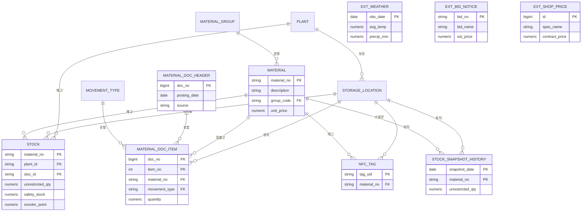

<h1 align="center">StockCast — NFC·실 공공데이터 기반 공공조달 재고관리 백오피스</h1>

<p align="center"><b>개인 졸업·포트폴리오 프로젝트</b> · 실제 ERP(Odoo) 연동형 재고관리 백오피스</p>

<p align="center">
  
  
  
  
  
  
  
  
  
  
  
  
</p>

> **공공조달 납품업체**가 NFC로 실물 재고를 기록하고, 실제 공공데이터(기상청 날씨·공휴일·나라장터 입찰공고·조달청 단가)로 수요를 예측해 발주를 결정하는 **백오피스(내부 운영) 시스템**입니다.
> 실물 재고·운영은 **실제 ERP(Odoo)** 가, 수요예측·안전재고·경영분석은 **StockCast 분석 엔진**이 맡아 **API(XML-RPC)로 양방향 연동**합니다.

> 🔗 **라이브 데모(HTTPS)** — **https://stockcast-yeondong.duckdns.org** · [대시보드](https://stockcast-yeondong.duckdns.org/dashboard) · [API 문서](https://stockcast-yeondong.duckdns.org/docs) · Odoo ERP `:8069`

<details open>
<summary><b>목차</b></summary>
<br>

* [1. 프로젝트 개요 · 기술 스택](#1-프로젝트-개요--기술-스택)
* [2. 아키텍처 — 운영계(OLTP) + 분석계(OLAP) 분리](#2-아키텍처--운영계oltp--분석계olap-분리)
* [3. 데이터 모델 (ERD)](#3-데이터-모델-erd)
* [4. 실 공공데이터](#4-실-공공데이터)
* [5. 수요예측 · 재고 분석](#5-수요예측--재고-분석)
* [6. ERP(Odoo) 양방향 연동](#6-erpodoo-양방향-연동)
* [7. NFC 입출고](#7-nfc-입출고)
* [8. 인프라 · 배포](#8-인프라--배포)
* [9. 보안 · 비밀값 관리](#9-보안--비밀값-관리)
* [10. 트러블슈팅](#10-트러블슈팅)
* [11. 한계와 개선점 · 실무 확장](#11-한계와-개선점--실무-확장)
* [12. 디렉터리 구조 · 실행](#12-디렉터리-구조--실행)

</details>

---

## 1. 프로젝트 개요 · 기술 스택

창고 직원이 NFC 태그로 입출고를 찍으면 **실제 ERP(Odoo)** 재고가 실시간 갱신됩니다. StockCast는 1년치 거래 이력과 **기상청 날씨·공휴일·나라장터 입찰공고·조달청 단가** 같은 실 공공데이터를 모아 품목별 수요를 예측하고, 안전재고·재주문점을 계산해 다시 **Odoo의 재주문 규칙으로 써넣습니다.** 관리자는 KPI 대시보드와 AI 운영요약으로 의사결정을 합니다.

목표는 **현직에서 바로 쓸 수준의 백오피스**를 만드는 것이었습니다. 실제 ERP를 그대로 쓰되, Odoo에는 없는(Enterprise 전용) **AI·수요예측을 StockCast가 채우는 것**이 차별점입니다.

### 기술 스택

| 분류 | 기술 | 용도 |
| :--- | :--- | :--- |
| **운영계 ERP** | Odoo 18 Community · XML-RPC | 실물 품목·재고·입출고·재주문 규칙 (system of record) |
| **분석계 백엔드** | Python 3.11 · FastAPI · SQLAlchemy 2.0 · psycopg3 | API · 자동 문서(/docs) · ORM |
| **분석계 DB** | PostgreSQL 16 (SAP MM 구조, 15개 엔터티) | 1년 거래 이력 + 외부 공공데이터 |
| **분석** | pandas · statsmodels(OLS·Holt-Winters·SARIMA) | 수요예측 · 안전재고/ROP · ABC |
| **AI** | LLM provider 추상화 (Gemini/Ollama/규칙 폴백) | 운영 요약 5관점 근거 서술 |
| **프론트엔드** | React · Chart.js (단일 HTML, 백엔드 서빙) | KPI · Odoo 실재고 · NFC 화면 |
| **외부데이터** | 공공데이터포털(기상청·특일·나라장터·조달청), KOSIS(선택) | 실수요·실가격·날씨·휴일 |
| **인프라** | Docker Compose · Terraform(IaC) · AWS EC2+EIP · Caddy(HTTPS) · DuckDNS | 컨테이너 · 코드형 인프라 · 자동 HTTPS |

---

## 2. 아키텍처 — 운영계(OLTP) + 분석계(OLAP) 분리

```
[NFC 스캔(Web NFC)] ─┐
                     ▼
            [StockCast (FastAPI)] ──XML-RPC──▶ [Odoo 18 (실제 ERP / 운영계)]
   ┌──────────────────┤   ◀── 실시간 재고 ──    품목·재고·입출고·재주문규칙
   ▼                  ▼ 재주문점·발주상한 write-back
[StockCast DB(분석계)]  [수요예측·안전재고·ABC·KPI·AI요약]
 1년 거래이력 + 외부공공데이터        │
 (날씨·공휴일·입찰·단가)             ▼
                         [React 대시보드 (KPI · Odoo 실재고 · NFC)]
                                 ▲ HTTPS (Caddy + Let's Encrypt)
```

- **Odoo = 운영계(system of record)** — 지금 이 순간의 실물 재고·입출고·재주문 규칙. 실시간 트랜잭션.
- **StockCast DB = 분석계(데이터 웨어하우스)** — 1년치 거래 이력 + 외부 공공데이터. 그 위에서 회귀·시계열·집계.
- **양방향 연동** — (정방향) StockCast 재주문점·발주상한 → Odoo 재주문 규칙 / (역방향) Odoo 실재고 → 대시보드.

> **왜 DB를 둘로 나눴나** — ① 외부 데이터(날씨·공휴일·입찰·단가)는 ERP에 저장할 자리가 없는데 예측은 "출고량 × 그날 날씨"를 조인해야 한다. ② 무거운 분석 쿼리를 실시간 운영 DB에 돌리면 입출고 업무가 느려진다. ③ 매 조회마다 Odoo에서 1년치를 끌어와 회귀를 돌리면 느리다. → 현직 표준인 **OLTP/OLAP 분리**.

---

## 3. 데이터 모델 (ERD)

SAP MM 표준(MARA·MARD·MKPF·MSEG·BWART) 구조를 차용한 **15개 엔터티**. 마스터·코드성·거래·이력성·외부 공공데이터로 분류했다. (오라클 DDL은 `db/oracle/stockcast_oracle_schema.sql` — 모델링 툴 리버스 엔지니어링용)



| 분류 | 엔터티 |
| :--- | :--- |
| 마스터 | `plant` · `storage_location` · `material` |
| 코드성 | `material_group` · `movement_type` · `ext_holiday` |
| 거래 | `material_doc_header` · `material_doc_item` |
| 재고/현황 | `stock` · `nfc_tag` |
| 이력성 | `stock_snapshot_history` (월말 재고 스냅샷) |
| 외부 공공데이터 | `ext_weather` · `ext_bid_notice` · `ext_shop_price` · `ext_retail_index` |

> 입출고는 **자재문서(헤더+품목) 전기 → 이동방향(±1)×수량으로 재고 갱신**. 외부 공공데이터 5종은 FK로 묶지 않고 분석 단계에서 **날짜로 논리 조인**한다.

---

## 4. 실 공공데이터

모두 공개 API로 수집한다. 설계 공통: **HTTP 호출부/파싱부 분리(파싱 단위테스트)**, `merge`로 **멱등 upsert**, 키 없으면 **건너뛰고 안내**(키 없어도 항상 동작).

| 데이터 | 출처 | 역할 |
| :--- | :--- | :--- |
| 일별 날씨(기온·강수) | 기상청 ASOS | 수요 동인 (제설·난방 겨울↑, 냉방·제초 여름↑) |
| 공휴일 | 한국천문연구원 특일정보 | 주말·휴일 수요 보정 |
| 물품 입찰공고 | 조달청 나라장터 | **실수요 신호** |
| MAS 계약단가 | 조달청 종합쇼핑몰 | **실가격** (재고자산·ABC) |

`scripts/collect_real_data.py` 가 날씨·공휴일을 먼저 적재한 뒤, 거래를 **실제 날씨·공휴일에 반응**하도록 생성한다(`use_real_weather=True`). 커넥터 하나가 실패해도 **rollback 후 계속**해 핵심 데이터(품목·거래)는 항상 완성된다.

> 개별 판매 트랜잭션은 없어 수요량 자체는 모델로 생성하되, 입력으로 **실제 기온·강수·휴일**을 넣어 반응시켰다. 단가는 조달청 실계약가, 입찰은 나라장터 실공고 — "실데이터에 반응하는 시뮬레이션"이다.

---

## 5. 수요예측 · 재고 분석

- **수요예측 2종** — 다중회귀(OLS, 해석 가능: "기온 1℃당 출고 X개") + 시계열(Holt-Winters/SARIMA, 추세·요일 계절성). 분산 0 변수로 통계가 NaN/Inf가 되면 None으로 안전 처리.
- **재고 이론** — 안전재고 `SS = Z·σ·√L`, 재주문점 `ROP = 평균일수요·L + SS`, 발주상한 `= 평균일수요·(L+검토주기) + SS`.
- **경영 지표** — ABC(매출 파레토), 재고회전율, 결품률, 재고자산금액(운전자본).
- **AI 운영요약** — 운영현황·수요회전·재고건전성·ABC·권장조치 **5관점**을 근거와 함께 서술. 키 없으면 규칙 기반 폴백으로 항상 동작.

---

## 6. ERP(Odoo) 양방향 연동

| 방향 | 내용 | 구현 |
| :--- | :--- | :--- |
| 정방향 | StockCast 재주문점·발주상한 → Odoo **재주문 규칙**(stock.warehouse.orderpoint) | `scripts/odoo_sync_reorder.py` |
| 역방향 | Odoo **실시간 재고**(qty_available) → 대시보드 "Odoo 실재고" 탭 | `app/api/odoo.py` `/stock` |
| 적재 | 조달 품목 30종·초기재고 → Odoo product/stock.quant | `scripts/odoo_load.py` |
| NFC | 태그 스캔 → Odoo 실재고 입/출고 | `/api/odoo/nfc-scan` |

> **DB 직접 접근이 아니라 API(XML-RPC)인 이유** — Odoo의 비즈니스 로직·정합성 검증을 우회하지 않기 위해서다. 공식 인터페이스라 안전하고, 버전이 바뀌어도 계약이 유지되는 **느슨한 결합**. 온라인 무료판은 외부 API가 막혀 있어 **자체 호스팅**으로 API를 열었다.

---

## 7. NFC 입출고

각 실물 태그의 UID를 품목에 매핑(`nfc_tag`)해두고, 스캔하면 그 품목을 **Odoo 실재고에 입고(+)/출고(−)** 한다. 입력은 ① 실물 폰 태깅(Web NFC, 안드로이드 크롬) ② 등록 태그 클릭(데모) 두 방식.

> Web NFC는 **HTTPS(보안 컨텍스트)** 에서만 동작하므로, 실물 폰 태깅을 위해 배포에 HTTPS를 적용했다(§8). iOS는 Web NFC 미지원. NFC 입출고는 운영 입력이라 **항상 운영계(Odoo)로만** 보낸다.

---

## 8. 인프라 · 배포

`infra/terraform/`로 **AWS EC2(t3.small) + Elastic IP + 보안그룹**을 코드로 정의하고, `infra/caddy/`로 HTTPS를 붙였다.

| 요소 | 선택 이유 |
| :--- | :--- |
| **Terraform(IaC)** | 콘솔 클릭은 재현·추적 불가 → 코드로. t3.micro→small·EIP·포트 개방을 `apply` 한 번으로 |
| **t3.small (2GB) + 스왑** | Odoo 권장 2GB+ → micro(1GB) 부족 |
| **Elastic IP** | 인스턴스를 중지/재시작해도 공인 IP·도메인 연결이 유지됨 |
| **Caddy + DuckDNS** | 도메인에 Let's Encrypt 인증서 자동 발급. HTTPS는 **Web NFC 동작 조건** |

```bash
# AWS: 인프라 프로비저닝 → 서버에서 코드 받고 실데이터 적재 → Odoo 적재 → HTTPS
cd infra/terraform && terraform apply          # EC2·EIP·SG
# (서버) docker compose up -d --build && collect_real_data.py
# (서버) infra/odoo up → odoo_load.py → odoo_sync_reorder.py
# (서버) infra/caddy up  → 자동 HTTPS
```

---

## 9. 보안 · 비밀값 관리

| 막은 것 | 어떻게 |
| :--- | :--- |
| 키가 깃에 올라가는 것 | `.env`를 `.gitignore`로 제외, 코드는 `settings`로만 읽음. Terraform `tfvars`도 제외 |
| 외부 노출 | 운영 접속은 HTTPS(Caddy), SSH는 내 IP만(보안그룹) |
| API 키 강제 호출 | 외부 키 없으면 수집은 건너뛰고 규칙 폴백으로 동작 |

> 개인 면접 대비·설계 상세 문서(`docs/StockCast_*`)는 개인용이라 `.gitignore`로 비공개. 공개용 설계 문서는 **[docs/설계_및_결정.md](docs/설계_및_결정.md)**.

---

## 10. 트러블슈팅

배포·통합까지 가며 실제로 막혔던 것들과 해결입니다.

- **온라인 Odoo는 외부 API가 막혀 있었다.** 무료/스탠다드 플랜은 XML-RPC가 Custom(유료) 전용 → **Docker 자체 호스팅**으로 전환해 API를 열었다.
- **t3.micro(1GB)로 Odoo가 안 떴다.** Terraform으로 **t3.small(2GB)** 로 변경 + 스왑 2GB. 인스턴스 변경 시 IP가 바뀌어서 **Elastic IP**로 고정했다.
- **시드가 FK 위반으로 깨졌다.** 자재그룹(부모)보다 자재(자식)를 먼저 INSERT → `seed_master`에 `flush()` 추가.
- **수요예측 API가 500(JSON 직렬화).** 분산 0 변수로 통계가 NaN/Inf → Starlette `allow_nan=False` 직렬화 실패. 통계값을 `None`으로 안전 치환.
- **수집이 반쪽만 적재됐다.** 외부 커넥터 하나가 실패하면 테이블만 drop된 채 멈춤 → 커넥터별 `try/except + rollback`으로 핵심 데이터는 항상 완성.
- **같은 날짜 공휴일 PK 충돌**(어린이날·부처님오신날 5/5) → 이름을 합쳐 dedup.
- **HTTP라 Web NFC 불가** → Caddy + DuckDNS로 HTTPS를 붙여 실물 폰 태깅 가능하게 했다.

---

## 11. 한계와 개선점 · 실무 확장

**한계**

- 수요는 모델 생성치다(실 판매 트랜잭션 부재). 실거래가 연동되면 정확도가 올라간다.
- 현재고 정답은 Odoo이고 StockCast DB는 분석용이라, 실시간 완전 동기는 아니다(역방향 조회로 대체).
- 인증/권한·감사로그 미구현(PoC 범위). 단일 EC2라 인스턴스가 죽으면 멈춘다.

**실무로 간다면**

- **실거래 연동** — POS/주문 데이터로 수요를 실측해 예측 정확도 향상.
- **RDS 분리 · Multi-AZ** — 백업·가용성 위임, 분석 배치(스냅샷 적재) 스케줄링(EventBridge).
- **RBAC · 시크릿 매니저** — 인증/권한과 AWS Secrets Manager.
- **예측 고도화** — 외생변수 추가, 비선형 모델, 백테스트 자동화.

---

## 12. 디렉터리 구조 · 실행

```
erp 자산관리시스템/
├── backend/
│   ├── app/
│   │   ├── api/            # materials·stock·nfc·external·forecast·reorder·kpi·insight·odoo
│   │   ├── services/       # external·nara·pps·kosis·odoo·ai_insight·llm·inventory
│   │   ├── models/mm.py    # SAP MM 구조 15개 엔터티(ORM)
│   │   └── main.py
│   ├── tests/              # pytest 54건 (SQLite 인메모리)
│   └── init_db.py
├── analytics/              # forecast(회귀·시계열) · inventory(안전재고/ROP)
├── frontend/dashboard.html # React 단일 파일 (KPI·Odoo실재고·NFC)
├── db/
│   ├── seeds/seed_orm.py   # 조달 품목 30종 + 실데이터 기반 거래
│   └── oracle/             # Oracle DDL (리버스 엔지니어링용)
├── scripts/                # collect_real_data·odoo_load·odoo_sync_reorder·odoo_ping
├── infra/
│   ├── terraform/          # EC2·EIP·보안그룹 (IaC)
│   ├── odoo/               # Odoo Community 스택
│   └── caddy/              # HTTPS 리버스 프록시
├── docs/                   # 설계_및_결정.md · ERD·엔터티정의서
└── README.md
```

**로컬 실행 (Docker)**

```bash
cp .env.example .env                                              # 키 입력(없으면 합성으로 동작)
docker compose up -d --build                                     # 1) StockCast 기동
docker compose exec -T backend python /workspace/scripts/collect_real_data.py   # 2) 실데이터 적재
cd infra/odoo && docker compose -f docker-compose.odoo.yml up -d # 3) Odoo 기동(브라우저 :8069 DB생성·재고관리 앱 설치)
docker compose exec -T backend python /workspace/scripts/odoo_load.py           # 4) 품목·재고 적재
docker compose exec -T backend python /workspace/scripts/odoo_sync_reorder.py   #    분석→Odoo 재주문규칙
```

| 화면 | 로컬 | 운영(AWS) |
| :--- | :--- | :--- |
| 대시보드 | http://localhost:8000/ | https://stockcast-yeondong.duckdns.org/ |
| API 문서 | http://localhost:8000/docs | https://stockcast-yeondong.duckdns.org/docs |
| Odoo ERP | http://localhost:8069/ | http://stockcast-yeondong.duckdns.org:8069/ |

**테스트**

```bash
docker compose exec -T backend pytest -q   # 54건
```

---

<p align="center"><sub>개인 졸업·포트폴리오 프로젝트 · 실데이터·실제 ERP·HTTPS 배포까지 검증한 공공조달 재고관리 백오피스.</sub></p>

## 라이선스

[MIT](LICENSE)
</content>
</invoke>

