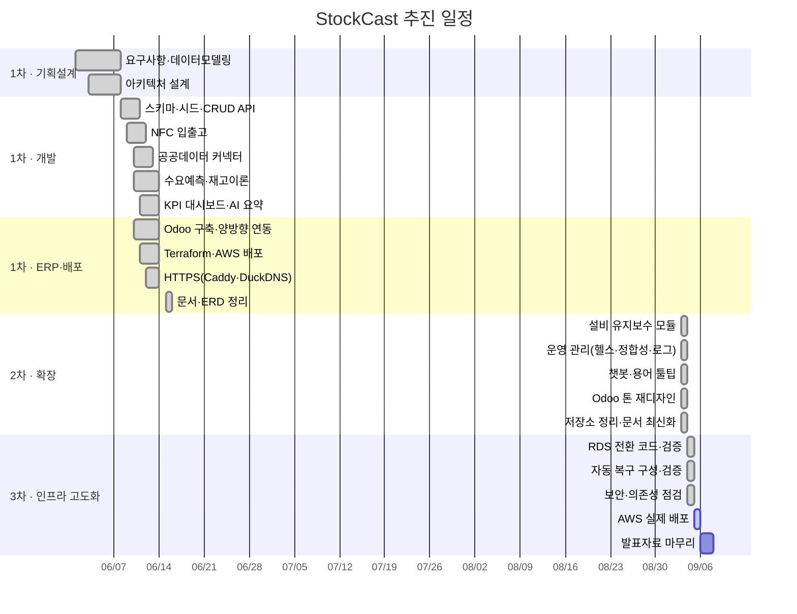

# WBS · 추진 일정

StockCast — NFC와 공공데이터로 돌아가는 공공조달 재고관리 백오피스
김연동 / 2026-09-03 기준 / v2.0

처음 계획(v1.0, 2026-06-02)은 12주 단일 트랙이었는데, 실제로는 6월에 1차 개발을
하고 9월에 2차 확장을 하는 식으로 나뉘었다. 그래서 이 문서로 다시 정리했다.
원본 계획서는
[제출산출물/StockCast_프로젝트일정_12주_김연동_20260602.xlsx](../제출산출물/StockCast_프로젝트일정_12주_김연동_20260602.xlsx)에
그대로 남겨뒀다.

---

## 1. 작업 분해

```mermaid
flowchart TB
    P["StockCast<br/>재고관리·수요예측 백오피스"]

    P --> W1["1. 기획·설계"]
    P --> W2["2. 데이터 기반"]
    P --> W3["3. 핵심 기능"]
    P --> W4["4. 분석 엔진"]
    P --> W5["5. ERP 연동"]
    P --> W6["6. 운영 기능"]
    P --> W7["7. 인프라·배포"]
    P --> W8["8. 품질·문서"]

    W1 --> W11["1.1 요구사항 정의"]
    W1 --> W12["1.2 데이터 모델링"]
    W1 --> W13["1.3 아키텍처 설계"]

    W2 --> W21["2.1 스키마 구현(ORM)"]
    W2 --> W22["2.2 시드 데이터"]
    W2 --> W23["2.3 공공데이터 커넥터"]

    W3 --> W31["3.1 자재·재고 API"]
    W3 --> W32["3.2 자재문서 전기"]
    W3 --> W33["3.3 NFC 입출고"]

    W4 --> W41["4.1 EDA·상관분석"]
    W4 --> W42["4.2 수요예측"]
    W4 --> W43["4.3 안전재고·ROP"]
    W4 --> W44["4.4 KPI·ABC"]

    W5 --> W51["5.1 Odoo 구축"]
    W5 --> W52["5.2 정방향 write-back"]
    W5 --> W53["5.3 역방향 조회"]

    W6 --> W61["6.1 설비 유지보수"]
    W6 --> W62["6.2 운영 관리"]
    W6 --> W63["6.3 챗봇·용어툴팁"]

    W7 --> W71["7.1 Docker"]
    W7 --> W72["7.2 Terraform"]
    W7 --> W73["7.3 HTTPS"]
    W7 --> W74["7.4 CI/CD"]
    W7 --> W75["7.5 DB 전환·자동복구"]

    W8 --> W81["8.1 테스트"]
    W8 --> W82["8.2 문서화"]
```

---

## 2. 작업 목록

완료 ●, 진행 ◐, 예정 ○

### 1. 기획·설계

| WBS | 작업 | 산출물 | |
|:---|:---|:---|:---:|
| 1.1 | 요구사항 정의(기능·데이터·비기능) | [요구사항정의서.md](요구사항정의서.md) | ● |
| 1.2 | 논리·물리 데이터 모델링 (SAP MM 차용) | [ERD.md](../설계/ERD.md), [테이블명세서.md](../설계/테이블명세서.md) | ● |
| 1.3 | 아키텍처 설계 (운영계/분석계 분리) | [시스템아키텍처.md](../설계/시스템아키텍처.md) | ● |
| 1.4 | 기술 선택 근거 정리 | [설계_및_결정.md](../설계/설계_및_결정.md) | ● |

### 2. 데이터 기반

| WBS | 작업 | 산출물 | |
|:---|:---|:---|:---:|
| 2.1 | ORM 스키마 구현 (18개 엔터티) | `backend/app/models/` | ● |
| 2.2 | 시드 생성기 (조달 품목 30종 + 1년 거래) | `db/seeds/seed_orm.py` | ● |
| 2.3 | 기상청 ASOS 날씨 커넥터 | `services/external.py` | ● |
| 2.4 | 특일정보 공휴일 커넥터 (중복 dedup) | `services/external.py` | ● |
| 2.5 | 나라장터 입찰공고 커넥터 | `services/nara.py` | ● |
| 2.6 | 조달청 MAS 계약단가 커넥터 | `services/pps.py` | ● |
| 2.7 | 실데이터 통합 수집 파이프라인 | `scripts/collect_real_data.py` | ● |
| 2.8 | Oracle DDL (모델링 툴 리버스용) | `db/oracle/` | ● |

### 3. 핵심 기능

| WBS | 작업 | 산출물 | |
|:---|:---|:---|:---:|
| 3.1 | 자재·자재그룹 CRUD API | `api/materials.py` | ● |
| 3.2 | 재고 조회 API | `api/stock.py` | ● |
| 3.3 | 자재문서 전기 서비스 (재고 갱신·예외처리) | `services/inventory.py` | ● |
| 3.4 | NFC 태그 매핑·스캔 API | `api/nfc.py` | ● |
| 3.5 | Web NFC 스캔 화면 | `frontend/nfc-scan.html` | ● |

### 4. 분석 엔진

| WBS | 작업 | 산출물 | |
|:---|:---|:---|:---:|
| 4.1 | 피처 생성 (출고 × 날씨·휴일 조인) | `analytics/forecast/data_prep.py` | ● |
| 4.2 | EDA·상관분석 (신호 존재 확인) | 설계문서 6절 | ● |
| 4.3 | 다중회귀 수요예측 (OLS, 계수 해석) | `analytics/forecast/model.py` | ● |
| 4.4 | 시계열 예측 (Holt-Winters, SARIMA) | `analytics/forecast/timeseries.py` | ● |
| 4.5 | 안전재고·ROP·발주상한 산출 | `analytics/inventory/reorder.py` | ● |
| 4.6 | KPI 집계 (회전율·결품률·재고자산) | `api/kpi.py` | ● |
| 4.7 | ABC 파레토 분석 | `api/kpi.py` | ● |
| 4.8 | AI 운영요약 5관점 | `services/ai_insight.py` | ● |

### 5. Odoo 연동

| WBS | 작업 | 산출물 | |
|:---|:---|:---|:---:|
| 5.1 | Odoo 18 Community 자체 호스팅 | `infra/odoo/` | ● |
| 5.2 | 품목·초기재고 적재 (XML-RPC) | `scripts/odoo_load.py` | ● |
| 5.3 | 정방향 — ROP·발주상한 write-back | `scripts/odoo_sync_reorder.py` | ● |
| 5.4 | 역방향 — 실재고 조회 | `api/odoo.py` `/stock` | ● |
| 5.5 | NFC 스캔 → Odoo 실재고 반영 | `api/odoo.py` `/nfc-scan` | ● |

### 6. 운영 기능 (2차 확장)

| WBS | 작업 | 산출물 | |
|:---|:---|:---|:---:|
| 6.1 | 설비 마스터·정비오더 모델 (SAP PM) | `models/maintenance.py` | ● |
| 6.2 | 정비 완료 → 이동유형 261 재고 차감 | `services/maintenance.py` | ● |
| 6.3 | 설비 KPI (가동률·PM준수율·MTTR) | `api/maintenance.py` | ● |
| 6.4 | 헬스체크 (DB·Odoo·LLM·리소스) | `services/ops.py` | ● |
| 6.5 | 데이터 정합성 점검 9항목 | `services/ops.py` | ● |
| 6.6 | 요청 로그 링버퍼·미들웨어 | `core/logbuffer.py` | ● |
| 6.7 | 운영 챗봇 (의도분류 + LLM/규칙) | `services/chatbot.py` | ● |
| 6.8 | 경영용어 사전·툴팁 (35개) | `data/glossary.py` | ● |
| 6.9 | 대시보드 Odoo 톤 재디자인 (6탭) | `frontend/dashboard.html` | ● |

### 7. 인프라·배포

| WBS | 작업 | 산출물 | |
|:---|:---|:---|:---:|
| 7.1 | Docker Compose (앱·Odoo·Caddy 3스택) | `docker-compose.yml`, `infra/` | ● |
| 7.2 | Terraform IaC (EC2·EIP·SG) | `infra/terraform/` | ● |
| 7.3 | HTTPS (Caddy + Let's Encrypt + DuckDNS) | `infra/caddy/` | ● |
| 7.4 | CI — 테스트 자동화 | `.github/workflows/ci.yml` | ● |
| 7.5 | CD — 테스트 통과 후 배포 + 헬스체크 | `.github/workflows/deploy.yml` | ● |
| 7.6 | DB를 AWS RDS로 전환 | `infra/terraform/rds.tf`, `docker-compose.rds.yml`, `scripts/migrate_to_rds.sh`, [전환 문서](../운영/AWS_RDS_전환.md) | ◐ |
| 7.7 | 서버 자동 복구 | `infra/systemd/`, `infra/scripts/watchdog.sh`, `autorecovery.tf`, [자동복구 문서](../운영/서버_자동복구.md) | ◐ |
| 7.8 | 백업·복원 자동화 | `scripts/backup.sh` (`--verify`로 실제 복원까지 확인) | ● |
| 7.9 | 비용 관리 | `budget.tf`, `scripts/aws_server.sh`, 실단가 기반 구성별 비용표 | ● |
| 7.10 | 보안 점검 | 8000·8069 공개 차단, 웹 계층 취약점 9건 해소, CI에 `pip-audit` | ● |

◐ = 코드·문서·로컬 검증까지 끝. 실제 AWS 적용(apply)은 아직.
로컬에서 확인한 범위는 [개선제안](개선제안.md) 1절에 정리했다.

### 8. 품질·문서

| WBS | 작업 | 산출물 | |
|:---|:---|:---|:---:|
| 8.1 | 단위·통합 테스트 75건 | `backend/tests/` | ● |
| 8.2 | 테스트 환경 고정 (CI 결정성) | `tests/conftest.py` | ● |
| 8.3 | 설계 문서 (ERD·아키텍처·결정) | `docs/설계/` | ● |
| 8.4 | 운영 매뉴얼 | `docs/운영/` | ● |
| 8.5 | 문서 자동 생성기 (ORM → ERD·명세서) | `scripts/gen_docs.py` | ● |
| 8.6 | 포트폴리오 README | `README.md` | ● |
| 8.7 | 발표자료 최종본 | 발표 PPT | ○ |

---

## 3. 일정

---

## 4. 마일스톤

| | 마일스톤 | 판정 기준 | 시점 | |
|:---|:---|:---|:---|:---:|
| M1 | 데이터 모델 확정 | 요구사항·ERD·테이블명세서 제출 | 2026-06-02 | ● |
| M2 | 핵심 기능 동작 | NFC 입출고로 재고가 갱신됨 | 2026-06-09 | ● |
| M3 | 분석 엔진 완성 | 수요예측·안전재고·KPI 산출 | 2026-06-11 | ● |
| M4 | ERP 양방향 연동 | Odoo write-back + 실재고 조회 | 2026-06-13 | ● |
| M5 | 운영 배포 | HTTPS 도메인으로 외부 접속 | 2026-06-15 | ● |
| M6 | 운영 기능 확장 | 설비·운영관리·챗봇 + 테스트 75건 | 2026-09-03 | ● |
| M7 | 인프라 고도화 | RDS 전환 + 자동 복구 | 2026-09-10 | ○ |

---

## 5. 겪은 리스크와 대응

| 리스크 | 영향 | 어떻게 했나 | 결과 |
|:---|:---|:---|:---|
| 온라인 Odoo가 외부 API를 막음 | ERP 연동 불가 | Docker 자체 호스팅으로 전환 | 해소 |
| t3.micro(1GB)에서 Odoo가 안 뜸 | 시연 불가 | t3.small(2GB) + 스왑 2GB | 해소 |
| 인스턴스 바꾸니 IP가 변함 | 도메인·시연 링크 끊김 | Elastic IP 고정 | 해소 |
| HTTP에서 Web NFC 미동작 | 실물 태깅 시연 불가 | Caddy + DuckDNS로 HTTPS | 해소 |
| 공공 API 키 미발급·장애 | 데이터 수집 실패 | 커넥터별 rollback 후 계속, 합성 보정 | 해소 |
| 개발자 `.env`가 CI를 오염 | 빌드를 못 믿게 됨 | `conftest.py`로 테스트 환경 고정 | 해소 |
| 단일 EC2 — 죽으면 전체 정지 | 가용성 | RDS 분리 + 자동 복구 (7.6·7.7) | 진행 예정 |
| 수요가 실거래가 아닌 모델 생성치 | 예측 정확도 | 실데이터(날씨·휴일·단가)를 입력으로 사용 | 부분 완화 |

---

## 6. 산출물 정리

| 구분 | 산출물 | 위치 |
|:---|:---|:---|
| 설계 | 시스템아키텍처, ERD, 테이블명세서, 설계및결정 | `docs/설계/` |
| 관리 | WBS, 요구사항정의서 | `docs/관리/` |
| 운영 | 유지보수 운영매뉴얼 | `docs/운영/` |
| 코드 | 백엔드·분석·프론트·인프라 | `backend/` `analytics/` `frontend/` `infra/` |
| 품질 | pytest 75건, CI/CD 워크플로 | `backend/tests/` `.github/workflows/` |
| 학교 제출 | 계획서·DB모델링·일정 (시점 기록) | `docs/제출산출물/` |
| 모델링 과제 | DA# DDL·엔터티정의서 | `docs/모델링/` |
