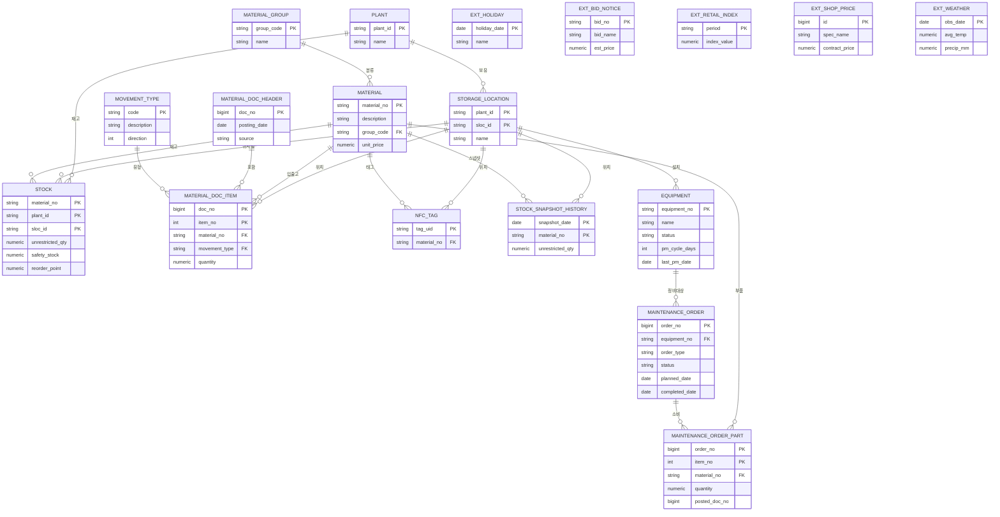

<!-- 이 문서는 scripts/gen_docs.py 가 ORM 모델에서 생성합니다. 직접 수정하지 마세요. -->
# StockCast 데이터 모델 (ERD)

엔터티 18개. SAP의 MM(자재관리)과 PM(설비 유지보수) 구조를 가져다 썼다.

*생성일 2026-09-03 · 원천 `backend/app/models/`*

---

## 1. 재고는 고치는 값이 아니라 계산되는 값이다

이 모델에서 재고 수량을 직접 UPDATE 하는 코드는 없다. 입출고가 생기면 자재문서
(`material_doc_header` + `material_doc_item`)를 남기고, 재고(`stock`)는 그 문서들을
누적한 결과로 나온다.

```
NFC 스캔 / 수기 입력 / 정비 부품 소비
    → 자재문서 생성 (헤더 1건 + 항목 N건)
    → 이동유형 방향(+1/−1) × 수량
    → stock.unrestricted_qty 갱신
```

번거로워 보이지만 이렇게 하면 세 가지가 따라온다.

우선 감사 추적이 남는다. 언제 무엇이 왜(이동유형) 움직였는지가 전부 기록되니까,
재고가 이상해도 거슬러 올라가 원인을 찾을 수 있다.

그리고 출고(이동유형 201) 이력이 그대로 수요 시계열이 된다. 수요예측을 위해
따로 데이터를 만들 필요가 없다.

마지막이 제일 중요한데, `Σ(방향 × 수량) = 재고` 라는 등식이 항상 성립해야 한다는
뜻이 된다. 이 등식이 깨졌다면 이동 없이 재고가 바뀐 것이므로 어딘가 문제가 있다.
운영 화면의 정합성 점검 C01이 이걸 계속 감시한다. 정비오더가 쓴 부품도 이동유형
261 자재문서로 남기 때문에 같은 식에 포함된다.

---

## 2. ERD



외부 공공데이터(`ext_*`)는 FK로 묶지 않았다. 수집 주기도 다르고 키 체계도 내부
마스터와 안 맞는데다, 커넥터 하나가 실패해도 핵심 데이터는 살아야 하기 때문이다.
분석할 때 날짜로 조인한다.

---

## 3. 엔터티 정의서

| No | 엔터티(논리) | 테이블(물리) | 분류 | SAP 원본 | PK | 설명 |
| :--- | :--- | :--- | :--- | :--- | :--- | :--- |
| 1 | 자재 | `material` | 마스터 | MARA+MAKT | `material_no` | 취급 품목 마스터. 판매단가를 포함해 재고자산·ABC 산출의 기준 |
| 2 | 사업장 | `plant` | 마스터 | T001W | `plant_id` | 재고를 보유하는 물류센터/사업장 단위 조직 |
| 3 | 저장위치 | `storage_location` | 마스터 | T001L | `plant_id + sloc_id` | 사업장 내 창고·보관 구역 |
| 4 | 외부-공휴일 | `ext_holiday` | 코드성 | — | `holiday_date` | 한국천문연구원 특일정보. 주말·휴일 수요 보정 |
| 5 | 자재그룹 | `material_group` | 코드성 | T023 | `group_code` | 품목 분류 코드(제설·안전·냉난방 등 8종) |
| 6 | 이동유형 | `movement_type` | 코드성 | BWART | `code` | 입출고 사유 코드와 방향(+1/−1). 재고 증감을 결정한다 |
| 7 | 자재문서 헤더 | `material_doc_header` | 거래 | MKPF | `doc_no` | 입출고 전기 단위. 전기일 기준으로 분석에 조인된다 |
| 8 | 자재문서 항목 | `material_doc_item` | 거래 | MSEG | `doc_no + item_no` | 실제 이동 내역. 출고(201) 이력이 곧 수요 시계열이 된다 |
| 9 | NFC 태그 | `nfc_tag` | 재고/현황 | — | `tag_uid` | 태그 UID ↔ 자재 매핑. 스캔 시 품목·저장위치를 해석한다 |
| 10 | 재고 | `stock` | 재고/현황 | MARD | `material_no + plant_id + sloc_id` | 저장위치별 가용재고 + 안전재고·재주문점. 자재문서의 누적 결과 |
| 11 | 재고 스냅샷 | `stock_snapshot_history` | 이력성 | — | `snapshot_date + material_no + plant_id + sloc_id` | 월말 재고 이력. 평균재고·회전율·결품률 계산 근거 |
| 12 | 외부-입찰공고 | `ext_bid_notice` | 외부 공공데이터 | — | `bid_no + bid_ord` | 조달청 나라장터 물품 입찰공고. 실수요 신호 |
| 13 | 외부-소매지수 | `ext_retail_index` | 외부 공공데이터 | — | `period + category` | 통계청 KOSIS 소매판매액지수(선택). 거시 수요 외생변수 |
| 14 | 외부-계약단가 | `ext_shop_price` | 외부 공공데이터 | — | `id` | 조달청 종합쇼핑몰 MAS 실 계약단가. 실가격 근거 |
| 15 | 외부-날씨 | `ext_weather` | 외부 공공데이터 | — | `obs_date` | 기상청 ASOS 일별 기온·강수. 계절 수요의 주 동인 |
| 16 | 설비 | `equipment` | 설비 유지보수 | EQUI+EQKT | `equipment_no` | 정비 대상 설비 마스터. 상태와 예방정비 주기를 갖는다 |
| 17 | 정비오더 | `maintenance_order` | 설비 유지보수 | AUFK/AFIH | `order_no` | 설비 1대에 대한 정비 작업 지시. 요청→진행→완료 |
| 18 | 정비 사용자재 | `maintenance_order_part` | 설비 유지보수 | RESB→MSEG | `order_no + item_no` | 정비가 소비하는 부품. 완료 시 이동유형 261로 전기된다 |

---

## 4. 설계하면서 정한 것들

**정규화** — 운영 테이블은 3NF까지 맞췄다. 반정규화는 스냅샷 이력
(`stock_snapshot_history`) 하나에만 썼는데, 월말 재고를 매번 자재문서에서
역산하면 회전율 조회가 너무 느려서다.

**복합 PK** — `stock`(자재+플랜트+저장위치)이나 `material_doc_item`(문서+항목)처럼
업무적으로 의미가 있는 식별자는 그대로 PK로 썼다. 대리키는 자연키가 마땅치 않은
`ext_shop_price`에만 쓴다.

**멀티테넌트 안 함** — `tenant_id` 같은 컬럼은 일부러 넣지 않았다. 단일 기업
백오피스가 목표라 조직 구조는 플랜트/저장위치 2단계로 충분하다.

**BigInteger 변형** — `BigInteger().with_variant(Integer, "sqlite")`를 쓴다.
운영은 PostgreSQL의 BIGSERIAL이지만 테스트는 SQLite 인메모리라, 이렇게 해야
양쪽에서 자동증가가 똑같이 동작한다.

---

## 5. 같이 보면 좋은 문서

- 컬럼 단위 명세는 [테이블명세서.md](테이블명세서.md)
- Oracle DDL은 `db/oracle/stockcast_oracle_schema.sql` (모델링 툴 리버스 엔지니어링용)
- 왜 이런 기술을 골랐는지는 [설계_및_결정.md](설계_및_결정.md)
