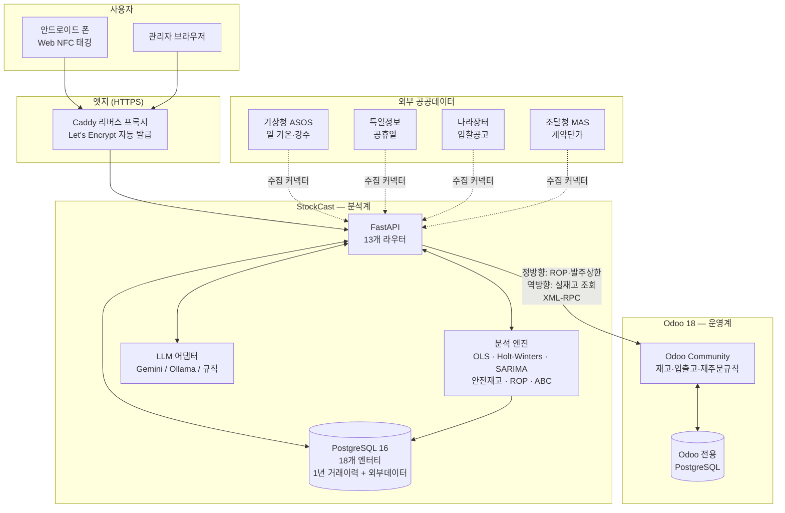
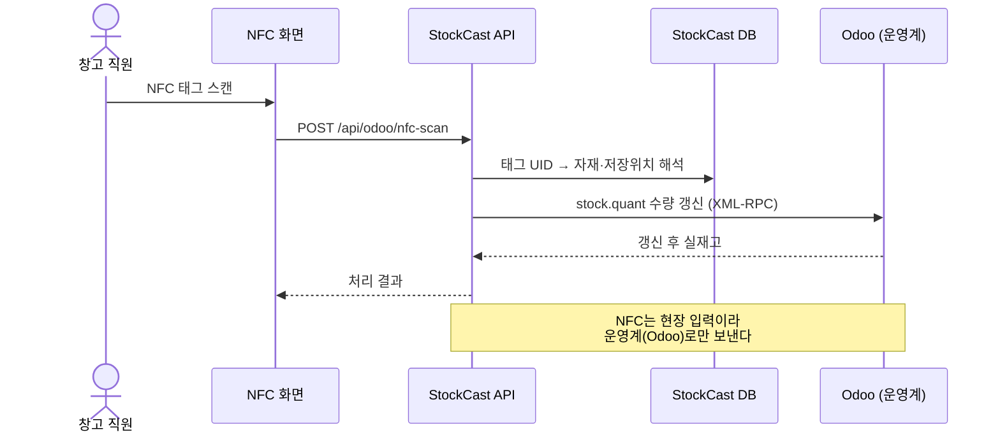
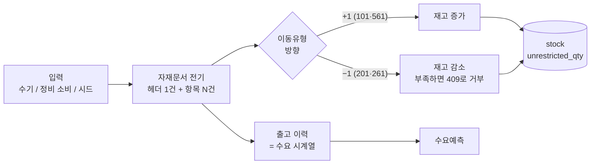
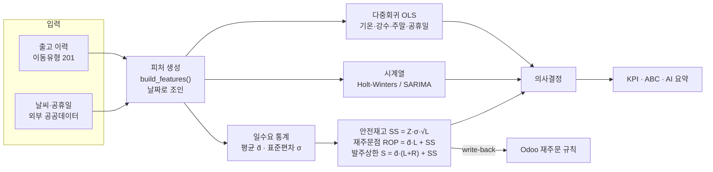
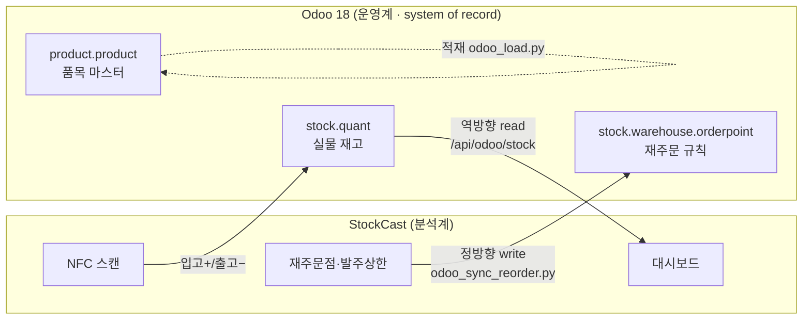
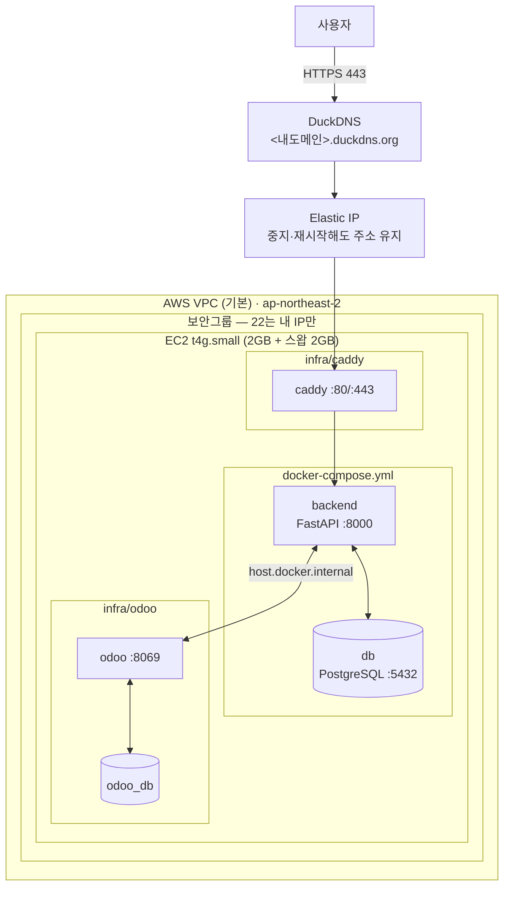
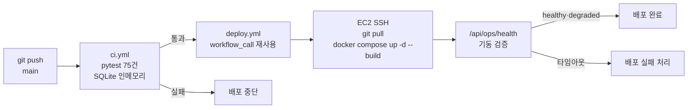
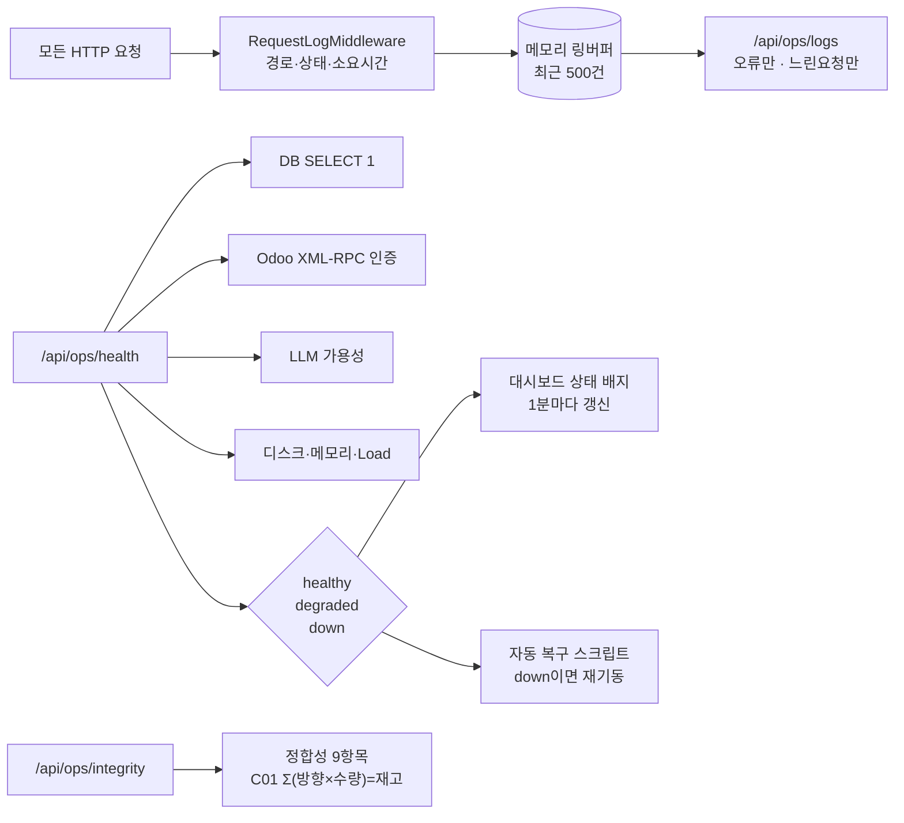

# 시스템 아키텍처

공공조달 납품업체가 쓰는 재고관리·수요예측 백오피스다. 실물 재고는 Odoo가 맡고,
분석은 StockCast가 맡는다. 둘을 API로 연결했다.

---

## 1. 전체 구성

DB가 두 개인 게 눈에 띌 텐데, 이유가 세 가지 있다.

첫째로 날씨·공휴일·입찰·단가 같은 외부 데이터는 ERP에 넣을 자리가 없다. 그런데
수요예측은 "그날 출고량 × 그날 기온"을 조인해야 나온다.

둘째로 무거운 분석 쿼리를 실시간 운영 DB에 돌리면 창고 입출고가 느려진다. 창고
직원이 물건 찍는데 화면이 멈추면 안 된다.

셋째로 매번 Odoo에서 1년치를 XML-RPC로 끌어와 회귀를 돌리면 너무 느리다.

결국 OLTP와 OLAP를 나누는 흔한 방식으로 갔다.

---

## 2. 입출고가 재고를 만든다

NFC 스캔은 실물이 실제로 움직이는 사건이니까 운영계로 바로 간다. 반면 수기 입력이나
정비 부품 소비는 분석계에서 자재문서로 처리한다.

여기서 `Σ(방향 × 수량) = 재고` 라는 등식이 나온다. 재고를 직접 UPDATE 하지 않기
때문에 항상 성립해야 하고, 안 맞으면 어딘가 잘못된 것이다. 운영 화면의 정합성
점검 C01이 이걸 계속 본다.

---

## 3. 분석 파이프라인

회귀를 쓴 건 정확도보다 해석 때문이다. 계수를 보면 "기온이 1℃ 내려가면 제설제
출고가 1.6개 늘어난다" 같은 문장이 그대로 나오고, 이게 발주 근거가 된다.
시계열은 날씨 예보를 못 구할 때를 위한 보완책이다. 외부 변수 없이도 돌아간다.

---

## 4. Odoo 연동

Odoo DB에 직접 붙는 게 빠르긴 하지만 그렇게 하지 않았다. Odoo가 가진 검증 로직을
통째로 건너뛰게 되기 때문이다. XML-RPC는 공식 인터페이스라 버전이 올라가도
계약이 유지된다. 참고로 Odoo 온라인 무료판은 외부 API가 막혀 있어서 Docker로
직접 띄웠다.

---

## 5. AWS 배포

인프라는 Terraform으로 짰다. 콘솔에서 클릭하면 나중에 뭘 어떻게 만들었는지
재현이 안 되고, 인스턴스 타입을 바꾸거나 포트를 열 때마다 손이 간다.

t3.micro로 시작했다가 Odoo가 안 떠서 2GB로 올렸다. 지금은 같은 2GB인 t4g.small(ARM)을 쓴다.
Odoo 권장 사양이 2GB
이상인데 micro는 1GB다. 스왑도 2GB 붙였다. 인스턴스 타입을 바꾸면 공인 IP가
바뀌는 바람에 도메인이 끊겨서 Elastic IP로 고정했다.

HTTPS는 Caddy가 Let's Encrypt 인증서를 알아서 받아온다. 이게 필요한 이유는
Web NFC가 보안 컨텍스트에서만 동작하기 때문이다. HTTP로는 폰 태깅이 아예 안 된다.

스택을 셋으로 나눈 건 Odoo가 전용 PostgreSQL을 요구하고, Caddy는 앱과 생명주기가
다르기 때문이다.

---

## 6. 배포 파이프라인

테스트가 외부 DB나 API 키에 의존하지 않는 게 중요하다. `backend/tests/conftest.py`가
app을 import 하기 전에 `DATABASE_URL`과 외부 키를 고정해버려서, 어느 환경에서
돌리든 SQLite 인메모리로 간다.

---

## 7. 계층별 기술 스택

| 계층 | 기술 | 역할 |
| :--- | :--- | :--- |
| 엣지 | Caddy 2 · Let's Encrypt · DuckDNS | HTTPS 종단, 리버스 프록시 |
| 프론트 | React 18 · Chart.js · Babel standalone | 단일 HTML 대시보드(빌드 도구 없음) |
| API | FastAPI 0.115 · pydantic 2 | REST + 자동 OpenAPI 문서 |
| 도메인 | SQLAlchemy 2.0 ORM | 자재문서 전기·재고 갱신·정비오더 |
| 분석 | pandas · statsmodels · numpy | 회귀·시계열·재고이론 |
| AI | provider 추상화 (Gemini/Ollama/규칙) | 운영 요약·챗봇 |
| 분석 DB | PostgreSQL 16 | 18개 엔터티 |
| 운영 ERP | Odoo 18 Community · XML-RPC | 실물 재고 system of record |
| 인프라 | Docker Compose · Terraform · AWS EC2+EIP | 컨테이너·IaC |
| CI/CD | GitHub Actions | 테스트 후 배포 + 헬스체크 |

---

## 8. 운영 상태를 어떻게 보는가

운영 기능을 앱 안에 넣었다. SSH로 들어가서 로그를 tail 하지 않고 브라우저에서 본다.

`/api/ops/health` 하나를 사람과 기계가 같이 쓴다. 화면에 뜨는 신호랑 자동 복구가
보는 신호가 다르면, 화면은 멀쩡한데 서버는 죽어 있는 상황이 생긴다.

---

## 9. 지금의 한계

| 현재 | 다음 단계 | 이유 |
| :--- | :--- | :--- |
| 단일 EC2에 DB 동거 | RDS 분리 · Multi-AZ | 백업·가용성을 관리형에 맡긴다 |
| 메모리 링버퍼 로그 | CloudWatch Logs | 재시작하면 로그가 날아간다 |
| 수동 헬스체크 | ALB 헬스체크 + Auto Scaling | 죽으면 자동 교체 |
| `.env` 파일 | AWS Secrets Manager | 키 회전·감사 |
| 인증 없음 | RBAC로 `/api/ops/*` 보호 | 운영 API가 열려 있다 |
| 수요는 모델 생성치 | POS·주문 실거래 연동 | 예측 정확도 |

---

## 같이 보면 좋은 문서

- 데이터 모델: [ERD.md](ERD.md), [테이블명세서.md](테이블명세서.md)
- 기술 선택 배경: [설계_및_결정.md](설계_및_결정.md)
- 운영 절차: [../운영/유지보수_운영매뉴얼.md](../운영/유지보수_운영매뉴얼.md)
